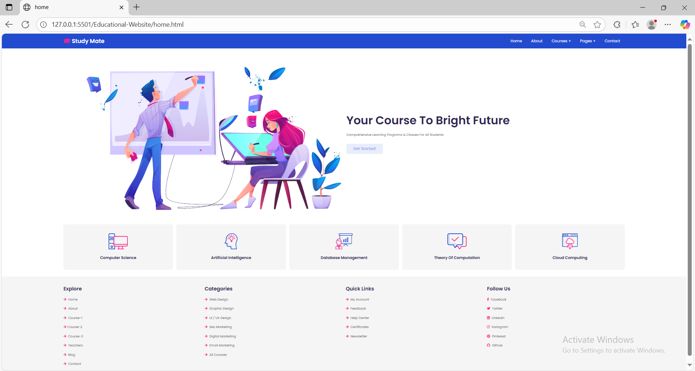
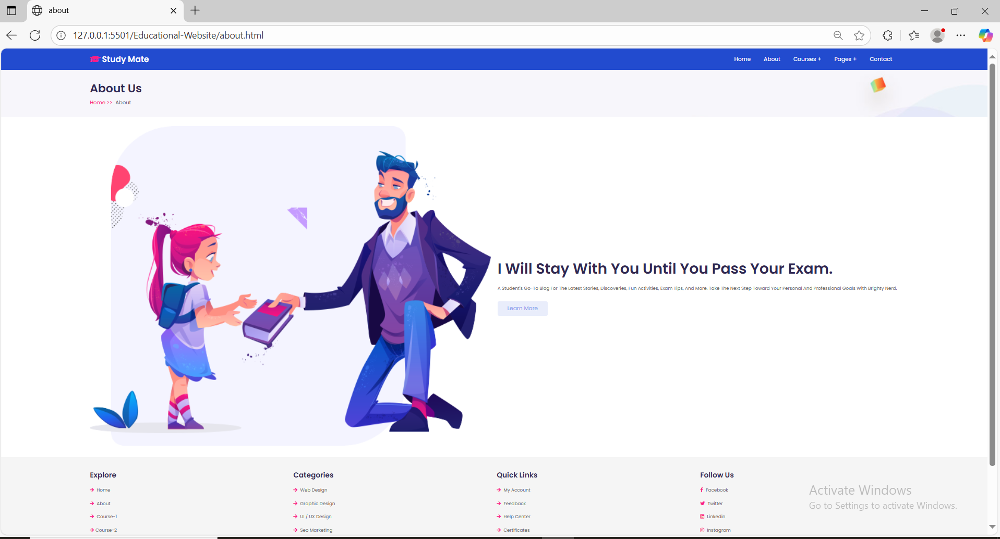
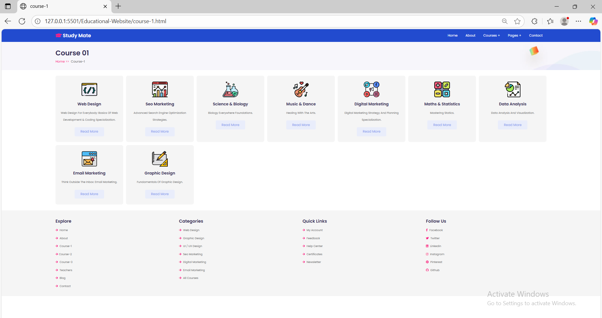
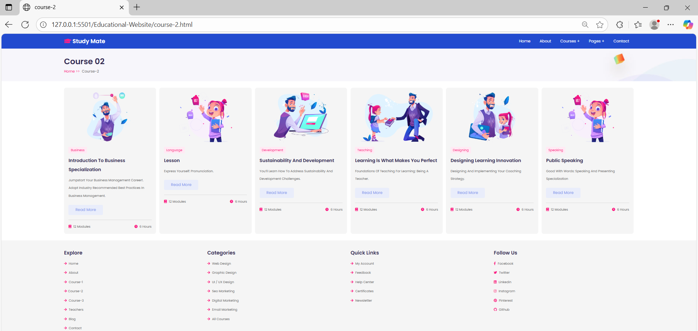
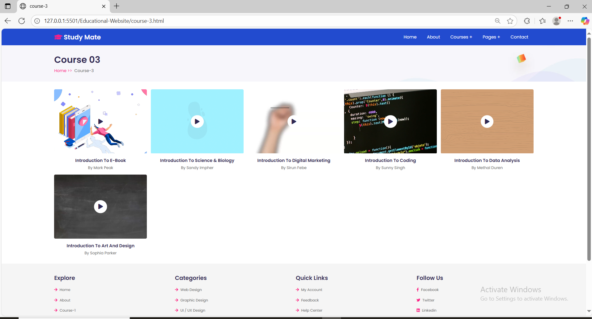
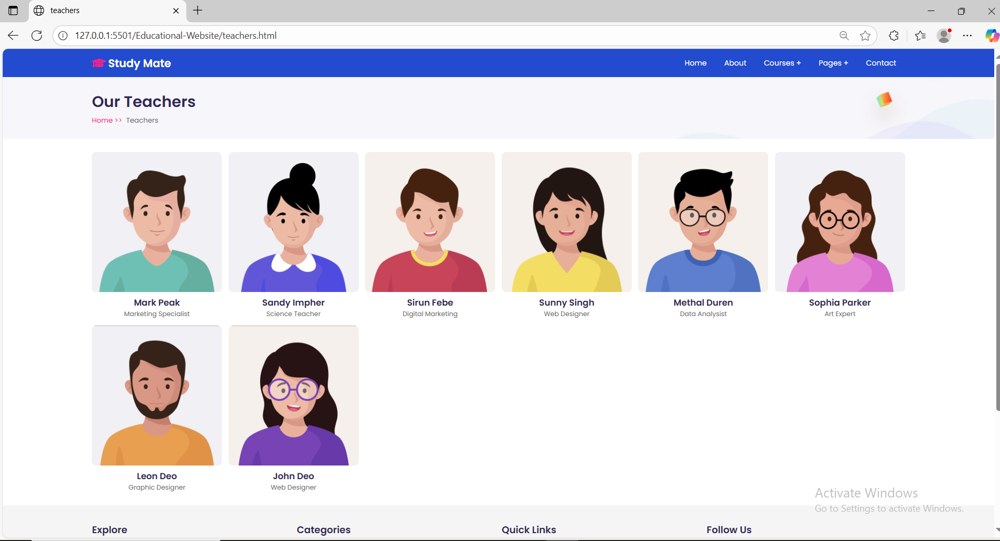
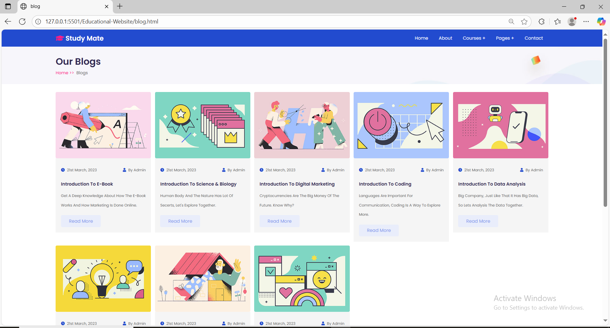

# 📚 StudyMate – Course Selling & Educational Website

StudyMate is a **responsive and user-friendly educational platform** built using **HTML, CSS, and JavaScript**.  
It is designed for **selling courses** and providing information about educational services, with a clean and modern UI.

---

## 🌟 Features

- **Home Page** – Engaging introduction with navigation to all sections.
- **About Page** – Brief description of the platform's mission and vision.
- **Courses Section** – Includes multiple courses:
  - Course 1
  - Course 2
  - Course 3
- **Pages Section** – Additional educational resources:
  - Teacher Profiles
  - Blog Articles
- **Contact Page** – Form to get in touch with the team.
- **Fully Responsive Design** – Works across desktops, tablets, and mobile devices.
- **Easy to Customize** – Simple HTML, CSS, and JS structure for quick modifications.

---

## 🛠️ Tech Stack

- **Frontend:** HTML5, CSS3, JavaScript
- **Design:** Responsive layout, Flexbox/Grid, Modern UI components
- **Media:** Images and icons for visual appeal

## 📸 Screenshots

### 🏠 Home Page


### ℹ️ About Page


### 📚 Courses – Course 1


### 📚 Courses – Course 2


### 📚 Courses – Course 3


### 👨‍🏫 Teachers Page


### 📝 Blog Page


### 📩 Contact Page


---


---

## 📦 Installation & Setup

1. **Clone the repository**
   ```bash
   git clone https://github.com/Rutuja-Agashe/studymate.git


---

## 📂 Project Structure

```plaintext
StudyMate/
│
├── index.html         # Home Page
├── about.html         # About Page
├── courses.html       # Courses Section
├── course1.html       # Course 1 Details
├── course2.html       # Course 2 Details
├── course3.html       # Course 3 Details
├── teacher.html       # Teachers Page
├── blog.html          # Blog Page
├── contact.html       # Contact Page
│
├── css/
│   └── style.css      # Main Stylesheet
│
├── js/
│   └── script.js      # Main JavaScript File
│
└── SS/            # Screenshots and assets


---


